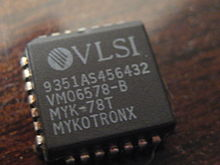
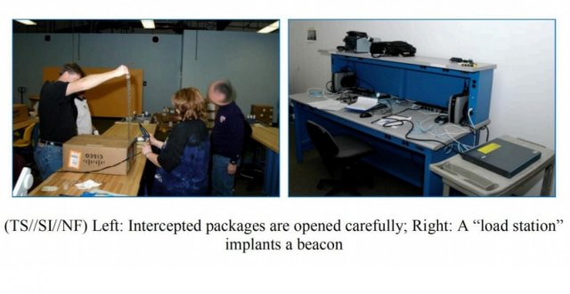

Since the time of [Ceasar](http://practicalcryptography.com/ciphers/caesar-cipher/), and probably earlier, wars have been lost and won by trading in secrets. For millennia, cryptanalysis has been at the core of intelligence services activities.

It is believed by historians that WW2 was won largely by Allied cryptanalysts. In years after WW2, ever since 1952, the  NSA had operated largely under the radar of general public.  One of the joking translations of the NSA abbreviation was No Such Agency.

When in the 70-ties IBM came up with simmetric-key encryption algorythm, [DES](https://en.wikipedia.org/wiki/Data_Encryption_Standard), the agency pushed for adoption of a weakened version of the algorithm as government-endorsed standard in 1977. This led to its adoption on international level.

US Senate Committee on Intelligence report published in 1978 said *"[[In the development of DES, NSA convinced IBM that a reduced key size was sufficient; indirectly assisted in the development of the S-box structures; and certified that the final DES algorithm was, to the best of their knowledge, free from any statistical or mathematical weakness.\]]*(https://en.wikipedia.org/wiki/Data_Encryption_Standard#cite_note-5)" 

 John Gilmore, of the [EFF](https://www.eff.org) fame, [says](http://www.toad.com/gnu/) about this:

"*The National Security Agency intervened when the scheme was being standardized in the early 1970s, shortening the secret keys so that they could build their own DES Crackers. But they spent the next 25 years lying to us about how secure the scheme is, to encourage everyone to use it -- and we did. This left NSA able to secretly eavesdrop on anyone who used DES, which includes the entire financial community, and most computer and network security systems. Technology has advanced to where anyone with $200,000 can break the code, leaving all of our DES-protected infrastructures at risk*. "

EFF spent $250000 to show feasibility of cracking DES, which was later abandoned in favor of [AES](https://en.wikipedia.org/wiki/Advanced_Encryption_Standard).

DES cracker, designed by EFF

Just a decade later, internet [recalls](http://www.nytimes.com/1994/06/12/magazine/battle-of-the-clipper-chip.html) the battle over privacy that took place during Clinton administration - the story of Clipper chip.

MYK-78 Clipper chip, photo y Travis Goodspeed (MYK-78 Package Markings) [<a href="http://creativecommons.org/licenses/by/2.0">CC BY 2.0</a>], <a href="https://commons.wikimedia.org/wiki/File%3AMYK-78_Clipper_chip_markings.jpg">via Wikimedia Commons</a>

In short, the NSA pushed for a standard - and an actual cryptographic chip to be used in devices - cryptographically "secure", with government in possession of decryption keys, held in escrow and available upon presenting a legal provision to use it.
Wide adoption failed miserably, not the least due to classified encryption algorithm [Skipjack](https://en.wikipedia.org/wiki/Skipjack_(cipher)), later declassified.

When in 2013 now famous NSA contractor Edward Snowden revealed the scope of backdoors NSA used by subverting cryptography standards - general public saw it as news. Experts didn't. Problems with standard for random number generators, recommended by the NIST and ANSI standard bodies, were reported [as early as 2006](https://eprint.iacr.org/2006/190), and Bruce Schneier [wrote about it in Wired](https://www.wired.com/2007/11/securitymatters-1115/) in 2007, saying, quote *"Which is why you should worry about a new random-number standard that includes an algorithm that is slow, badly designed and just might contain a backdoor for the National Security Agency*". 

Later it was shown that this recommended standard, known as Dual Elyptic Curve Deterministic Random Bit Generator - Dual_EC_DRBG - was heavily exploited for backdoors in servers / operating systems around the world, and gave NSA ability to listen in on communication of large part of the planet. It was **big**.

This wouldn't be a problem in itself - software has vulnerabilities, and cryptographic experts make mistakes. The problem was that government agency pushed for this algorithm - with a known vulnerability - to be formally endorsed as industry standard - for software and hardware systems, operating systems around the world. For securing routers, servers, firewalls. It was pushed internationally as ISO standard.

It was later reported that the [NSA had payed off RSA](http://www.reuters.com/article/us-usa-security-nsa-rsa/exclusive-nsa-infiltrated-rsa-security-more-deeply-than-thought-study-idUSBREA2U0TY20140331) - pioneer of commercial public-key encryption - $10 million - to include the compromised algorithm in its software solutions - and later [used this inclusion as an argument](https://en.wikipedia.org/wiki/RSA_Security#Alleged_NSA_Dual_EC_DRBG_backdoor) for the algorithm to be formally endorsed by [National Institute of Standards and Technology](https://en.wikipedia.org/wiki/National_Institute_of_Standards_and_Technology).

As numerous security experts have asserted, this push for a wide adoption of algorithms/generators known to be vulnerable, made systems potentially exposed not only to government agencies, but also to hackers who knew what they were doing. This is a history of putting surveillance above security - consciously jeopardizing security of a wide array of systems just to get a hold of more information. They sought millions and millions in funding from the budget to finance planting backdoors into commercial software. Hundreds of millions.

These are just subversions of standards that are known.

But there is more. According to Glenn Greenwald's [article in Guardian](https://www.theguardian.com/books/2014/may/12/glenn-greenwald-nsa-tampers-us-internet-routers-snowden) in 2014, quoting NSA's own report, it routinely intercepts network hardware for export - such as firewalls, servers, routers. "The agency then implants backdoor surveillance tools, repackages the devices with a factory seal and sends them on."

Leaked internal agency's newsletter quotes the manager: 
*"Here’s how it works: shipments of computer network devices (servers, routers, etc,) being delivered to our targets throughout the world are **intercepted**. Next, they are **redirected to a secret location** where Tailored Access Operations/Access Operations (AO-S326) employees, with the support of the Remote Operations Center (S321), enable the **installation of beacon implants** directly into our targets’ electronic devices. These devices are then re-packaged and placed back into transit to the original destination. All of this happens with the support of Intelligence Community partners and the technical wizards in TAO."*

We hope to publish a more thorough exploration of the scope of surveillance we are subject to in one of our future articles.

So when the agency released pair of block cipher algorithms meant for primarily resource-restrictive hardware / IOT, in 2013, and pushed for its adoption as global standard by ISO, it faced a pushback. 

Among other objections, researchers found weaknesses in these algorithms, like [this](https://www.iacr.org/workshops/fse2014/slides-09_1.pdf) differential cryptanalysis report by scientists of the Bauhaus university in Weimar from 2014.

A number of US delegates to ISO included NSA officials. Oponents, namely Japanese, German, and Israeli delegates to ISO, cryptography experts, raised reservations about these algorithms. There were disputes at Jaipur talks in India in 2015, in Abu Dhabi in 2016, and in Hamilton, New Zealand, this year. 

US delegations finally, not able to reach 2/3 consensus, dropped the most lighweight & vulnerable versions from its proposal, pushing for acceptance of the "sturdiest" versions, advancing the issue to final vote in February 2018.

Japan, Germany and Israel still remain opposed.

